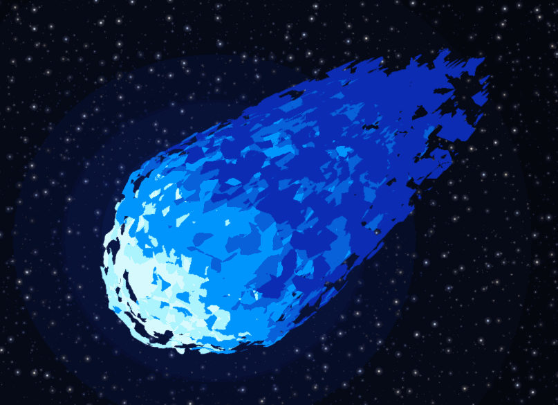
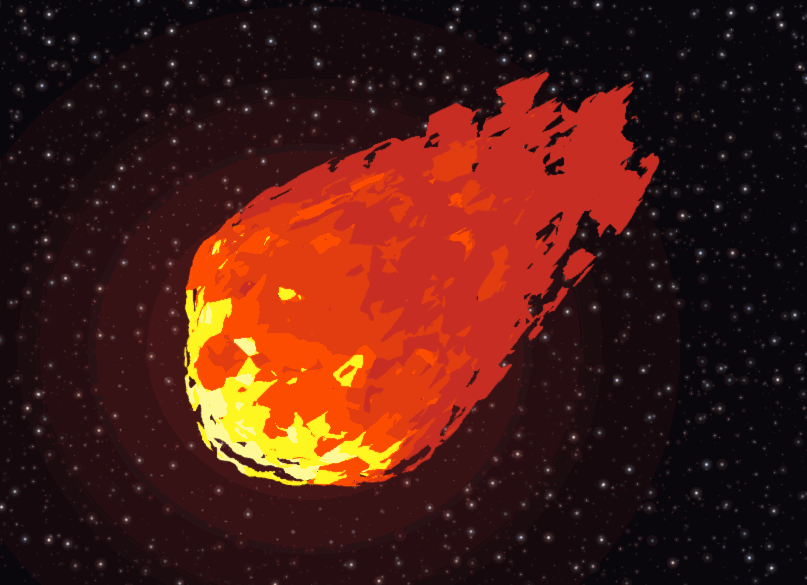
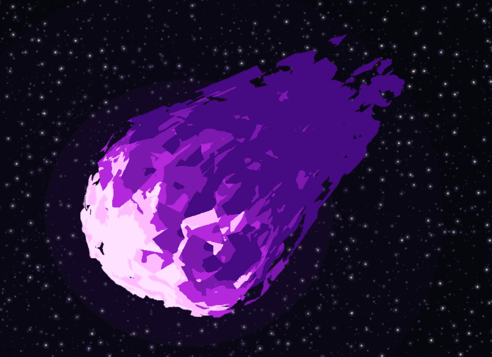
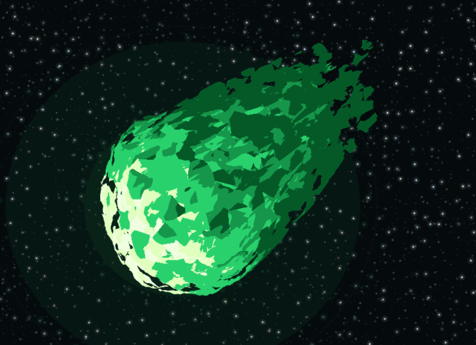

# HW 1: WebGL Fireball

A falling fireball built from a single icosphere, deformed and coloured entirely in GLSL.

[Live Demo](https://ronan83.github.io/hw01-fireball)

<table>
  <tr>
    <td align="center"> <b>Blue Plasma</b> (default)</td>
    <td align="center"> <b>Classic Fire</b></td>
  </tr>
  <tr>
    <td align="center"> <b>Violet Rift</b></td>
    <td align="center"> <b>Emerald Wisp</b></td>
  </tr>
</table>

## Overview

Everything is organised around a single **wake axis** `W`: the face pointing into the direction of travel is the compressed shock front, and the flame streams off the opposite side. Two decisions drive the look — the sphere stays a sphere, with only ridged-fBm crests shooting backward so the tongues separate instead of forming a cone; and the fireball is emissive, so no term anywhere shades a colour downward.

## Vertex shader

**Low-frequency, high-amplitude layer.** Three time-offset sinusoids of the form `f(x, y, z) = h` displace vertices radially, weighted toward the leading face.

**High-frequency, low-amplitude layer.** A five-octave value-noise fBm adds fine detail on top, scrolling over time.

**Flame tongues.** A ridged fBm (`1 - |2n - 1|`) is sampled *across* the wake cross-section, in the plane perpendicular to `W`, with the axial coordinate weighted low — this keeps each tongue coherent along its length instead of boiling. Raising the field to a power means only the upper crests extend backward, and each tongue narrows in proportion to how far it reached.

**Surge.** A sawtooth phase drives an impulse spike travelling from the head out to the tips.

**Normals** are recomputed by finite differences on the displaced surface, otherwise the shading follows the original sphere.

## Nested shells

The icosphere is drawn once per shell (`shellCount`, 1–6). One uniform, `u_ShellT`, drives every per-shell difference: scale, wake reach, shred amount, temperature offset, and noise seed — so the shells interleave rather than nest as scaled copies. They are drawn opaque with plain depth testing; each discards a large fraction of itself and the hotter core shows through the gaps, which avoids transparency sorting and keeps the flat colours from muddying.

## Fragment shader

**Cellular colour.** A 3D Voronoi returns the winning cell's random value, constant across that cell, so the surface is already piecewise flat — no posterising of a smooth gradient needed.

**Ordered heat, jagged boundaries.** The axial gradient dominates the heat value; the cell randoms only jitter it. An axis-only term quantises into concentric rings, while cell-dominated heat scatters hot and cool blocks at random and reads as camouflage. Together they give ordered zones with cell-shaped edges.

**Displacement drives colour.** The crest value from the vertex shader is the largest non-axial contribution to heat, so the geometry that protrudes furthest is the hottest.

**Shredding** removes *whole cells*, giving clean-edged flakes rather than the speckled fringe a per-pixel noise threshold produces.

## Extra Spice — background

Rather than leave the fireball in a black void, the scene is a procedural backdrop built in `background-frag.glsl`:

- **Starfield.** Three layers of jittered cells at different scales. Each star gets its own twinkle phase and colour temperature, and is offset from its cell centre so no grid is visible.
- **Heat glow.** A radial glow tinted by the fireball's own `emberColor`, breathing slowly over time, so the ball appears to light the space around it. Switching palette retints the background with it.
- **Star washout.** Stars are dimmed inside the glow. This is the detail that sells it — without the contrast, the glow is just a colour overlay rather than a light source.

## Toolbox functions

| Function | Where | What it does |
|---|---|---|
| **Bias** | vertex + fragment | Sharpens the ridged noise into distinct tongues; basis for gain |
| **Gain** | vertex + fragment | Contrast on the head/wake blend and on the heat gradient |
| **Sawtooth** | vertex | Phase for the repeating surge cycle |
| **Impulse** | vertex | The surge itself — fast rise, slow decay |
| **Ease in/out quadratic** | vertex | Softens the compression of the leading face |

## Interactive controls

| Control | Effect |
|---|---|
| `tesselations` | Icosphere subdivision |
| `streamSpeed` | How fast the flame streams backward |
| `detailOctaves` | fBm octave count |
| `surfaceChurn` | Amplitude of both displacement layers |
| `wakeReach` | How far the tongues extend |
| `shellCount` | Number of nested shells, 1–6 |
| `emberColor` / `blazeColor` / `coreColor` | The three colours the five-tier palette is built from |
| `palette` | Preset: Blue Plasma, Classic Fire, Violet Rift, Emerald Wisp |
| `Reset Defaults` | Restores the art-directed defaults |

Each preset changes more than hue — cell density, tongue taper, tier count, surge strength and shred amount all shift. Dragging `shellCount` to 1 shows most clearly what the layering contributes.
